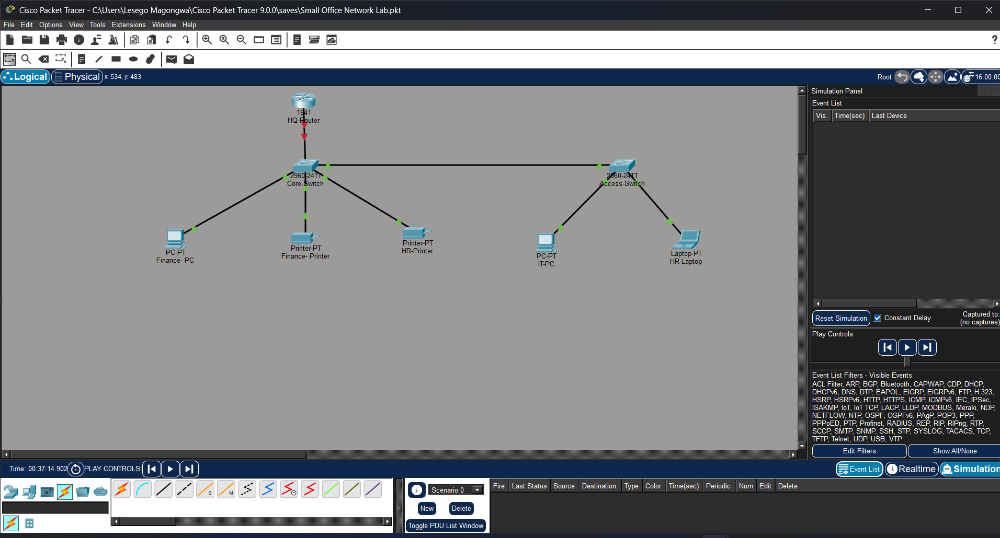

# Lab 01 – Small Office Network

## Objective

Build and configure a small office Local Area Network (LAN) using Cisco Packet Tracer.

---

## Network Topology

---

## Devices Used

- Cisco 1941 Router
- Cisco 2960 Core Switch
- Cisco 2960 Access Switch
- 2 Desktop PCs
- 1 Laptop
- 2 Network Printers

---

## Skills Practiced

- Static IPv4 addressing
- Switch-to-switch connectivity
- Router connectivity
- ICMP (Ping)
- ARP Request and Reply
- Packet Tracer Simulation Mode

---

## Testing

- All devices were assigned static IP addresses.
- Connectivity was verified using the `ping` command.
- ARP Requests and Replies were observed before ICMP packets in Simulation Mode.

---

## What I Learned

During this lab, I learned:

- How devices communicate within the same LAN.
- Why ARP is required before ICMP communication.
- How switches forward Ethernet frames using MAC addresses.
- How to verify network connectivity using Ping.
